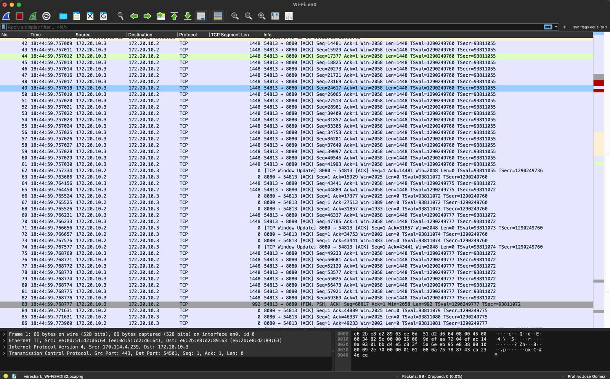

# Laboratorio 3 - Parte 2

## Cifrado de Información

### Adrian Rodríguez Batres 21691 y José Daniel Gómez Cabrera 21429

## Preguntas para reflexión

1. ¿Se puede identificar que los mensajes están cifrados con AES-CBC?

   - No se puede identificar, Wireshark no muestra ninguna señal de que la comunicación de paquetes esté cifrada. El archivo que enviamos de forma cifrada está de cierta forma "oculto".

2. ¿Cómo podríamos proteger más esta comunicación?
   - Creo que podría protegerse de mejor manera por medio de implementaciones de privacidad, como TLS (Transport Layer Security) o SSL(Secure Sockets Layer). Estos protocolos permiten la comunicación segura entre dos sistemas, protegiendo la integridad y confidencialidad de los datos que se envían.

## Cliente

Como se puede observar, la ip que envía el paquete es **172.20.10.3** y la ip que recibe el paquete es **172.20.10.2**.

## Servidor

Del lado del servidor, se puede observar que la ip que envía el paquete (origen) es **172.20.10.3** y la ip de destino es **172.20.10.2**, la cual es la del servidor.

